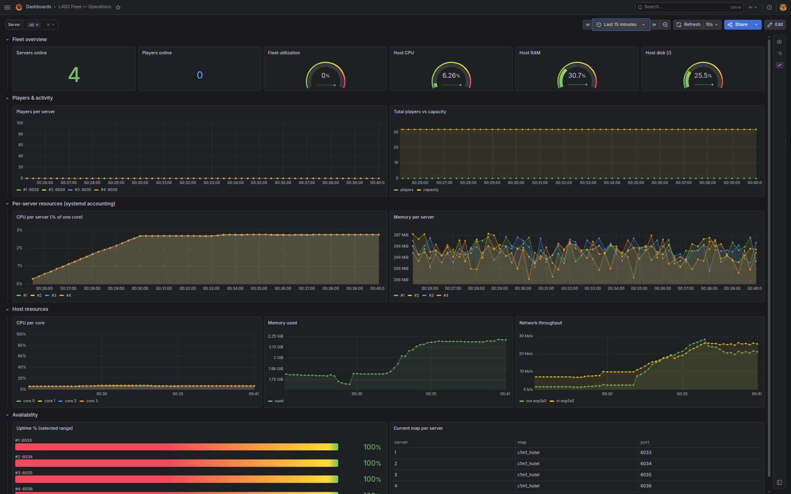
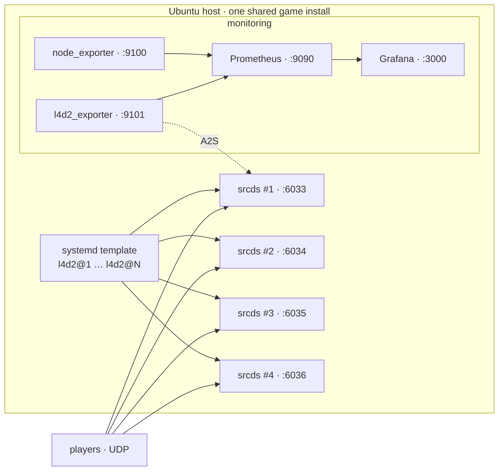

# l4d2-fleet

Run several Left 4 Dead 2 (ZoneMod) dedicated servers on one Ubuntu box and keep an
eye on them with Prometheus and Grafana. It's packaged as an Ansible role, so a blank
machine goes to N running servers with a single `ansible-playbook` run.

I put this together to host a small pool of competitive servers at home without
hand-configuring each one. Adding a server means bumping a number — the port, name
and config are generated.



*The bundled Grafana dashboard: fleet overview, per-server CPU/RAM, host health and uptime.*

## What it does

- Installs the L4D2 dedicated server through SteamCMD and drops in
  [SirPlease's ZoneMod](https://github.com/SirPlease/L4D2-Competitive-Rework) on top.
- Runs each server as a systemd template instance (`l4d2@1`, `l4d2@2`, …) out of a
  single shared game install, so you don't keep N copies of ~9 GB around.
- Derives the port and in-game name from the instance number: server #3 comes up as
  `<name> #3` on `port_base + 3`.
- Auto-loads ZoneMod when the first player connects, and ships a small SourceMod
  plugin to manage admins from chat (`!admin add / list / delete`).
- Sets up monitoring — node_exporter for the host (CPU, RAM, network) and a small A2S
  exporter for the game (players, map, up/down per server) — wired into Prometheus
  with a Grafana dashboard.

## Architecture



## Requirements

- A host on Ubuntu 22.04 or 24.04. The L4D2 server is 32-bit, so the role enables `i386`.
- Ansible 2.15+ on whatever you run the playbook from.
- The game ports (UDP `port_base+1 … port_base+server_count`) forwarded to the host if
  you want players from outside your LAN — L4D2 traffic is UDP.

## Usage

```bash
git clone git@github.com-personal:Ventrax-01/l4d2-fleet.git
cd l4d2-fleet
cp group_vars/all.yml.sample group_vars/all.yml   # your settings (gitignored)
$EDITOR group_vars/all.yml          # set name, count, rcon password, admins
ansible-playbook playbook.yml --ask-become-pass
```

The bundled `inventory.ini` targets `localhost`, so by default it provisions the
machine you run it on. Point `inventory.ini` at a remote host to do it over SSH.

`--ask-become-pass` prompts once for the sudo password. If you run it somewhere without
a terminal (a non-interactive SSH session, for example), run the whole playbook under
sudo instead — `sudo ansible-playbook playbook.yml` — so become doesn't need to prompt.

When it finishes you have `server_count` servers running and, unless you set
`with_monitoring: false`, Grafana on `http://<host>:3000` — log in with `admin`/`admin`
and open the **L4D2 Fleet** dashboard.

Re-run the same command any time; the role is idempotent and only changes what drifted.

## Configuration

Override anything from `roles/l4d2_fleet/defaults/main.yml` in `group_vars/all.yml`
(or per host). The variables you'll actually touch:

| Variable          | Default              | Notes                                                   |
|-------------------|----------------------|---------------------------------------------------------|
| `base_name`       | `My ZoneMod Server`  | In-game name; the launcher appends ` #N`.               |
| `server_count`    | `4`                  | How many servers to run.                                |
| `port_base`       | `6032`               | Game port = `port_base + N` (server #1 → `6033/udp`).   |
| `start_map`       | `c1m1_hotel`         | Starting map.                                           |
| `tickrate`        | `100`                | Server tickrate.                                        |
| `maxplayers`      | `32`                 | Slot count per server.                                  |
| `public`          | `1`                  | Relax `sv_pure` so players with custom files can join.  |
| `steam_group`     | *(empty)*            | Steam group ID(s) to list the servers under; empty = none.|
| `steam_group_exclusive` | `0`            | `1` = only members of `steam_group` can connect.        |
| `admins`          | *(one root admin)*   | List seeded into `admins_simple.ini` — see below.       |
| `steam_user`      | `steam`              | Account that owns and runs the servers.                 |
| `install_dir`     | `/home/steam/l4d2`   | Shared game install.                                    |
| `game_ip`         | *(auto)*             | A2S target for the exporter; empty = auto-detect.       |
| `rcon_password`   | `change-me`          | Loopback only. Put the real one in an ansible-vault file.|
| `with_monitoring` | `true`               | Install and wire up Prometheus/Grafana.                 |
| `with_logs`       | `true`               | Ship journald logs to Loki and show them in Grafana.    |
| `loki_retention`  | `168h`               | How long Loki keeps the logs.                           |

`admins` is a list of SteamID + flags:

```yaml
admins:
  - { steamid: "STEAM_1:0:12345678", flags: "99:z" }   # root, high immunity
  - { steamid: "STEAM_1:1:87654321", flags: "cdef" }   # kick / ban / unban / slay
```

`group_vars/all.yml` is gitignored — copy it from `group_vars/all.yml.sample` and put your
real values (rcon password, admin SteamIDs, server name) there. They stay out of the repo
and `git status` stays clean. If you'd rather version your secrets, keep them in an
`ansible-vault` file instead.

## How it works

A single systemd template unit drives the whole fleet:

```
l4d2@N  →  /opt/l4d2-fleet/l4d2-run.sh N
```

The launcher reads `/etc/l4d2-fleet/fleet.env`, computes the port (`port_base + N`),
writes that instance's `server_N.cfg` on the spot — `exec server.cfg` plus the hostname
— and execs `srcds_run`. There are no per-server config files to maintain; a fifth
server is just `systemctl enable --now l4d2@5`.

The exporter queries each server over Steam's A2S protocol and exposes per-instance
metrics for Prometheus, e.g. `l4d2_players{instance="3",port="6035"} 4`.

## Admin management

The fleet bundles a small SourceMod plugin — `tcn_admin`, source in
`roles/l4d2_fleet/files/custom-plugins/scripting/` — that lets a root admin manage
access straight from chat:

```
!admin add <SteamID> <flags> [name]    # e.g. !admin add STEAM_1:0:12345678 z Pepe
!admin delete <SteamID>
!admin list
!admin help
```

It edits `admins_simple.ini` and reloads the admin cache, so no restart is needed. The
`admins` variable seeds the initial set at deploy time; anything added in-game persists
on top of it.

Flags: `z` root · `c` kick · `d` ban · `e` unban · `f` slay · `g` changemap · `m` rcon.
Prefix with an immunity level, e.g. `99:z`. Grab a connected player's SteamID with
`status` in the console.

## Day to day

```bash
systemctl start  l4d2@3      # one server
systemctl status l4d2@1
sudo systemctl enable --now l4d2@5   # add another (config generated, port 6037)
```

Config changes are edits to `group_vars/all.yml` followed by another
`ansible-playbook playbook.yml`. Re-running restarts only what changed.

## Monitoring

| Component        | Port   | Exposes                                                |
|------------------|--------|--------------------------------------------------------|
| Prometheus       | `9090` | Time-series store + query UI                           |
| node_exporter    | `9100` | CPU, RAM, disk, **network traffic**                    |
| l4d2_exporter    | `9101` | `l4d2_up` / `l4d2_players` / `l4d2_map_info` per server |
| Loki             | `3100` | Log store (localhost only)                             |
| Promtail         | `9080` | Ships the journal to Loki                              |
| Grafana          | `3000` | "L4D2 Fleet" dashboard (players, traffic, host health, logs) |

A few queries: `l4d2_players` · `sum(l4d2_up)` (servers online) · outbound Mbps
`rate(node_network_transmit_bytes_total[5m])*8/1e6`. These ports are not meant to be
public — leave them on the LAN.

### Logs

With `with_logs` on, Promtail reads each server's journal and ships it to Loki, pulling
the instance number out of the unit name (`l4d2@3.service` → `instance="3"`). The dashboard
has a **Logs** row that reuses the same `$server` variable, so picking a server filters
both its metrics and its logs — and it works for however many servers you run, since it's
keyed on the label, not a fixed list. Query in Grafana's Explore: `{job="l4d2"}` for the
whole fleet, `{job="l4d2", instance="3"}` for one.

## Project layout

```
l4d2-fleet/
├── playbook.yml · inventory.ini · ansible.cfg
├── group_vars/all.yml              # your settings
└── roles/l4d2_fleet/
    ├── defaults/main.yml           # every variable + its default
    ├── tasks/                      # dependencies · game · zonemod · fleet · monitoring
    ├── handlers/main.yml           # service restarts
    ├── templates/                  # fleet.env, l4d2@.service
    └── files/
        ├── l4d2-run.sh             # launcher
        ├── l4d2_exporter.py        # A2S → Prometheus exporter
        ├── custom-plugins/         # tcn_admin (.smx + source)
        └── monitoring/             # Prometheus scrape job + Grafana provisioning
```

## Notes / things that bit me

- App 222860 refuses to download unless the `windows → linux` platform switch happens
  in a *single* SteamCMD session — a long-standing SteamCMD quirk. The role handles it.
- On L4D2, `sv_consistency` only accepts `1`. Setting it to `0` server-side makes
  clients drop with "illegal client value". Letting custom files through is done with
  `sv_pure` instead, which is what `public: 1` flips.
- srcds doesn't answer A2S on `127.0.0.1`, so the exporter points at the host's real IP
  (auto-detected when `game_ip` is empty).
- ZoneMod auto-loads on the first human connection, not at boot — right after a restart
  an empty server looks like plain versus until someone joins.
- `fleet.env` holds the RCON password and is read by the launcher as `steam`, so it's
  installed `steam:steam 0640` — readable by the service, not world-readable.

## License

MIT — see [LICENSE](LICENSE).
