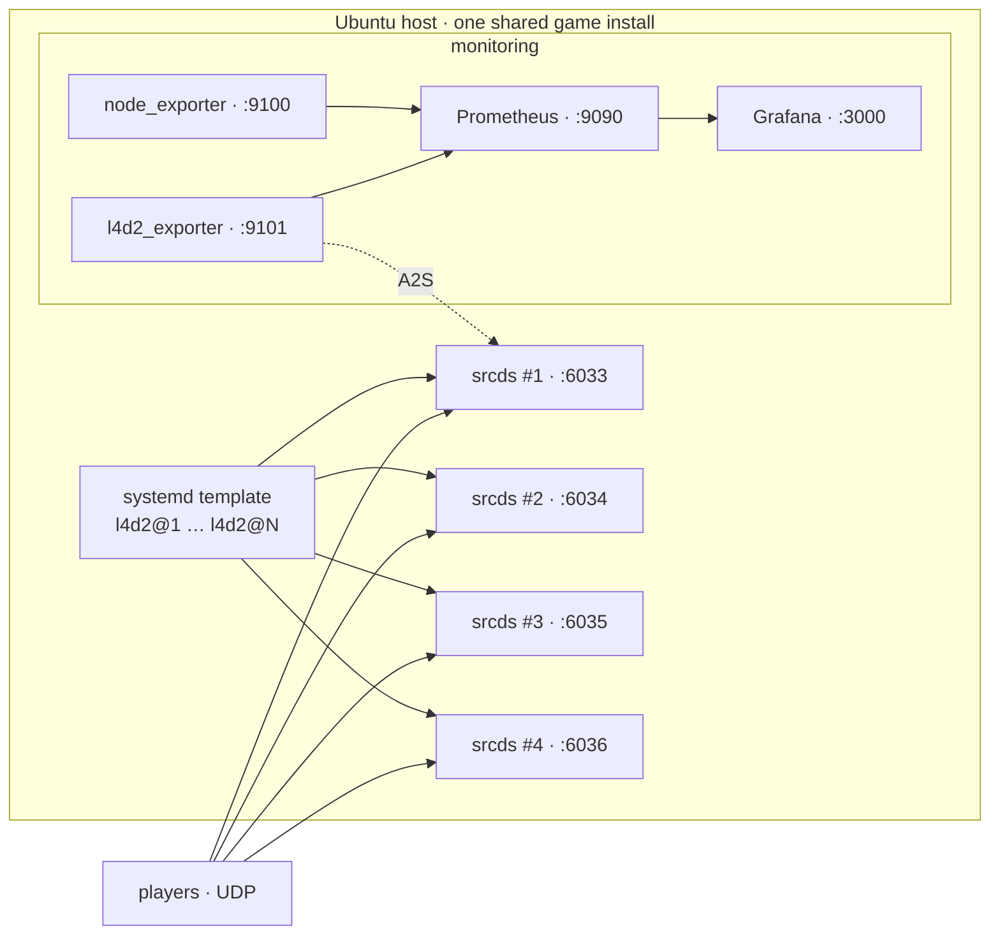

# l4d2-fleet

Run several Left 4 Dead 2 (ZoneMod) dedicated servers on one Ubuntu box and keep
an eye on them with Prometheus and Grafana. It's packaged as an Ansible role, so
going from a blank machine to N running servers is one `ansible-playbook` run.

I put this together to host a small pool of competitive servers at home without
hand-configuring each one. Adding a server means bumping a number — the rest
(port, name, config) is generated.

## What it does

- Installs the L4D2 dedicated server through SteamCMD and drops in
  [SirPlease's ZoneMod](https://github.com/SirPlease/L4D2-Competitive-Rework) on top.
- Runs each server as a systemd template instance (`l4d2@1`, `l4d2@2`, …) out of a
  single shared game install, so you don't keep N copies of ~9 GB around.
- Derives the port and in-game name from the instance number: server #3 comes up
  as `<name> #3` on `port_base + 3`.
- Sets up monitoring — node_exporter for the host (CPU, RAM, network) and a small
  A2S exporter for the game (player count, current map, up/down) — and wires both
  into Prometheus with a Grafana dashboard.
- Comes match-ready — ZoneMod auto-loads on the first connection, and a small bundled
  SourceMod plugin lets root admins manage access in-game (`!admin add/list/delete`).

## Requirements

- A host on Ubuntu 22.04 or 24.04. The L4D2 server is 32-bit, so the role enables
  `i386`.
- Ansible 2.12+ on whatever you run the playbook from.
- The game ports (UDP `port_base+1 … port_base+server_count`) forwarded to the host
  if you want players from outside your LAN — L4D2 traffic is UDP.

## Usage

```bash
git clone git@github.com-personal:Ventrax-01/l4d2-fleet.git
cd l4d2-fleet
$EDITOR group_vars/all.yml      # set your name, count, rcon password
ansible-playbook playbook.yml
```

The bundled inventory targets `localhost`, so by default it provisions the machine
you run it on; point `inventory.ini` at a remote host to do it over SSH.

When it finishes you'll have `server_count` servers running and (unless you set
`with_monitoring: false`) Grafana on `http://<host>:3000` — log in with
`admin`/`admin` and open the "L4D2 Fleet" dashboard.

## Configuration

Override anything from `roles/l4d2_fleet/defaults/main.yml` in `group_vars/all.yml`.
The variables you'll actually touch:

| Variable        | Default             | Notes                                                  |
|-----------------|---------------------|--------------------------------------------------------|
| `base_name`     | `My ZoneMod Server` | In-game name; the launcher appends ` #N`.              |
| `server_count`  | `4`                 | How many servers to run.                               |
| `port_base`     | `6032`              | Game port = `port_base + N` (server #1 → `6033/udp`).  |
| `start_map`     | `c1m1_hotel`        | Starting map.                                          |
| `tickrate`      | `100`               | Server tickrate.                                       |
| `public`        | `1`                 | Relax `sv_pure` so players with custom files can join. |
| `steam_user`    | `steam`             | Account that owns and runs the servers.                |
| `install_dir`   | `/home/steam/l4d2`  | Shared game install.                                   |
| `rcon_password` | `change-me`         | Bound to loopback. Put the real one in an ansible-vault file. |
| `with_monitoring` | `true`            | Install and wire up Prometheus/Grafana.               |

## How it works

A single systemd template unit drives the whole fleet:

```
l4d2@N  →  /opt/l4d2-fleet/l4d2-run.sh N
```

The launcher reads `/etc/l4d2-fleet/fleet.env`, computes the port (`port_base + N`),
writes that instance's `server_N.cfg` on the spot — `exec server.cfg` plus the
hostname — and execs `srcds_run`. There are no per-server config files to maintain;
a fifth server is just `systemctl enable --now l4d2@5`.

The exporter queries each server over Steam's A2S protocol and exposes per-instance
metrics for Prometheus, e.g. `l4d2_players{instance="3",port="6035"} 4`.



## Day to day

```bash
systemctl start  l4d2@3      # one server
systemctl status l4d2@1
sudo systemctl enable --now l4d2@5   # add another (config generated, port 6037)
```

Config changes are just edits to `group_vars/all.yml` followed by another
`ansible-playbook playbook.yml`.

## Things that bit me (so they don't bite you)

- App 222860 refuses to download unless the `windows → linux` platform switch
  happens in a *single* SteamCMD session — a long-standing SteamCMD quirk. The role
  handles it.
- On L4D2, `sv_consistency` only accepts `1`. Setting it to `0` server-side makes
  clients drop with "illegal client value". Letting custom files through is done with
  `sv_pure` instead, which is what `public: 1` flips.
- srcds doesn't answer A2S on `127.0.0.1`, so the exporter points at the host's real
  IP (auto-detected if you leave `game_ip` empty).

## License

MIT — see [LICENSE](LICENSE).
